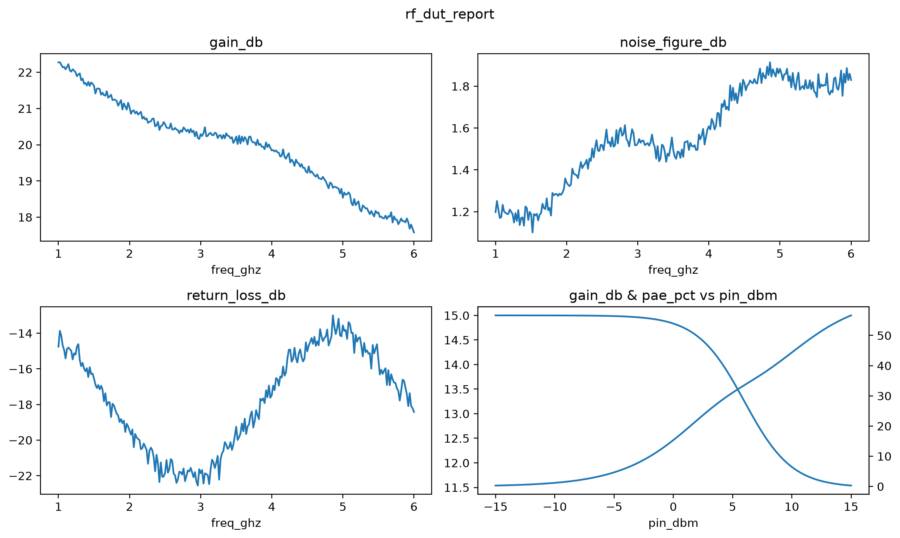
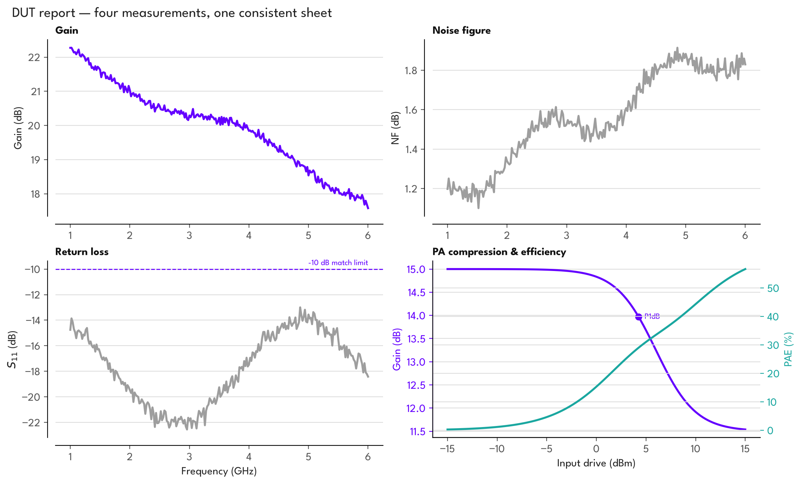
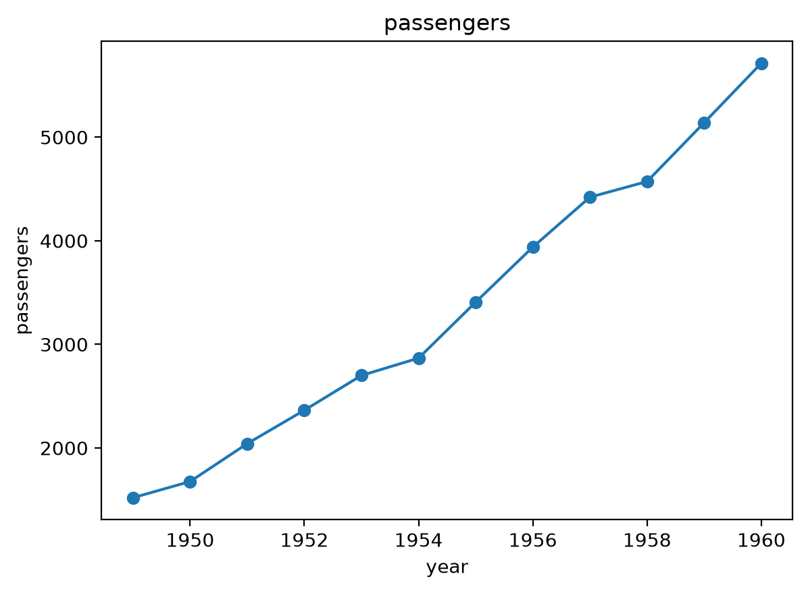
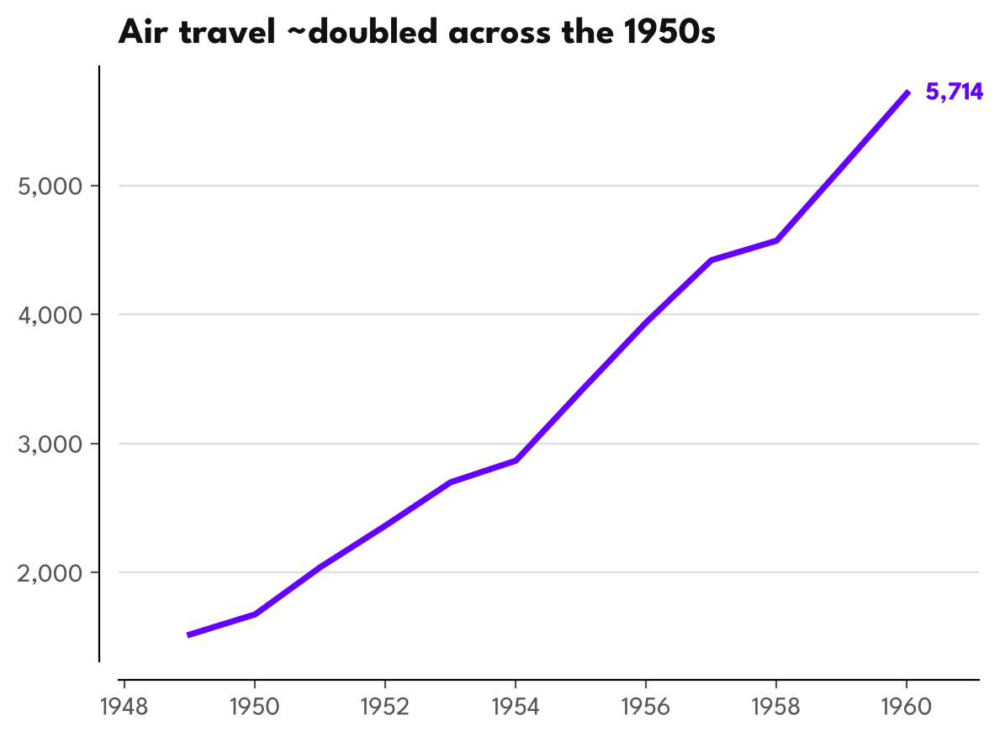
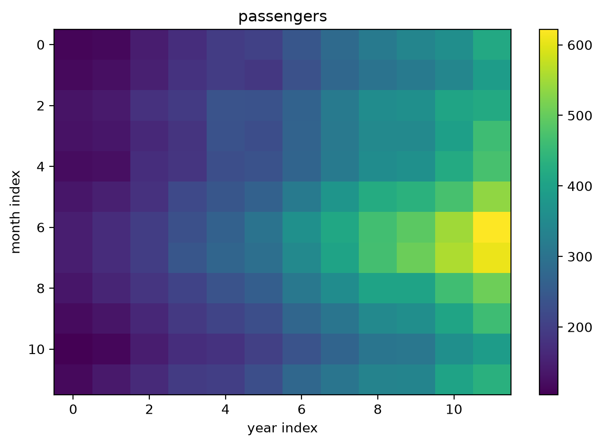
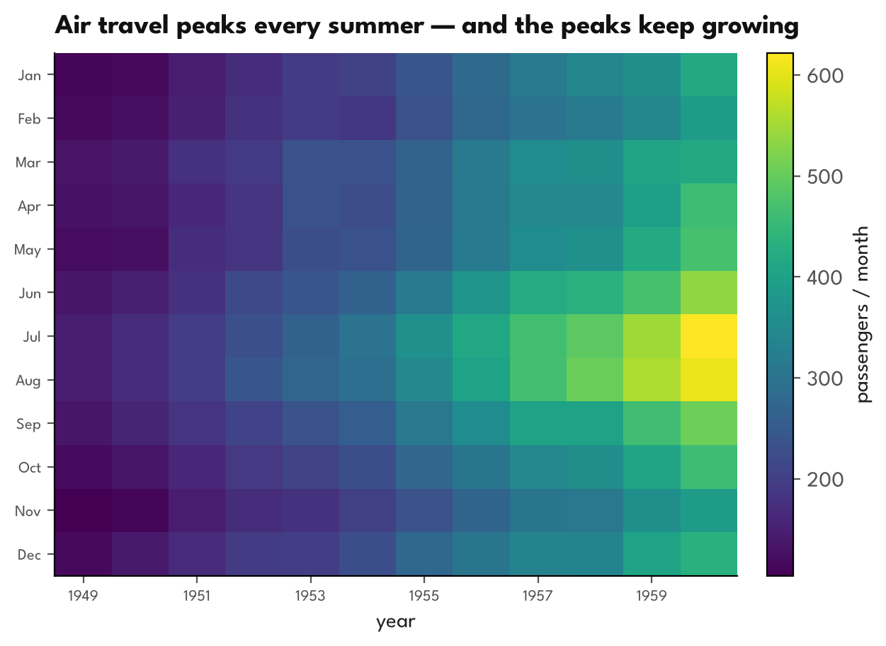
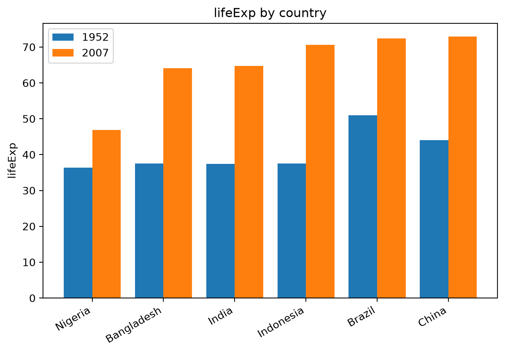
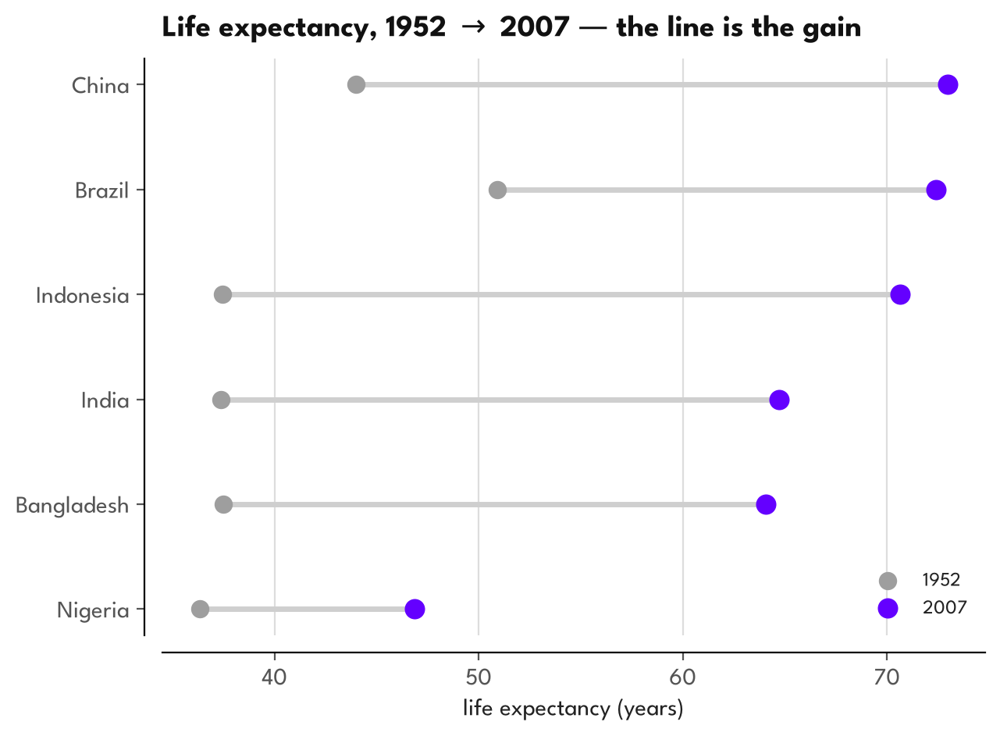

# Better Graphs

**Teach an AI agent to make matplotlib charts that don't look like matplotlib —
Tufte-grade figures, by writing taste down as rules.**

With AI, I can offload my unhealthy obsession with making graphs look nice to
agents! But they need to do a good job of it — not a question of competence
but of taste! Edward Tufte's [The Visual Display of Quantitative Information](https://www.edwardtufte.com/book/the-visual-display-of-quantitative-information/)
is our North star and the benchmark we're going to set for ourselves as
professional graph makers & communicators of scientific data!

📖 **Read it online (the live "blog"):** <https://temataro.github.io/better-graphs/>

---

Same data, same library — the only difference is **taste**, written down so an agent
applies it every time. Here's a real RF device report drawn the default matplotlib
way, then with this repo's house style:

<table>
<tr><td align="center"><b>Before</b> — plain matplotlib defaults</td></tr>
<tr><td></td></tr>
<tr><td align="center"><b>After</b> — the house style</td></tr>
<tr><td></td></tr>
</table>

### More before / afters

Raw default on the left, the full treatment on the right — every lesson in the
curriculum ends with one of these.

<table>
<tr>
  <td align="center"><b>Before</b> · a trend</td>
  <td align="center"><b>After</b></td>
</tr>
<tr>
  <td></td>
  <td></td>
</tr>
<tr>
  <td align="center"><b>Before</b> · a seasonality matrix</td>
  <td align="center"><b>After</b></td>
</tr>
<tr>
  <td></td>
  <td></td>
</tr>
<tr>
  <td align="center"><b>Before</b> · grouped bars for a change</td>
  <td align="center"><b>After</b> · the right chart</td>
</tr>
<tr>
  <td></td>
  <td></td>
</tr>
</table>

## What this is, in plain terms

A short **course** plus a **reusable style kit**. The rules live in plain files an AI
agent reads *before* it draws — so you (or your agent) get deliberate, presentation-ready
figures without re-explaining good taste each time. Three files do the real work:

- **[`CLAUDE.md`](CLAUDE.md)** — the operating manual: the workflow (choose the chart →
  theme → takeaway title → polish → export) and the hard rules.
- **[`VISUALIZATION_GUIDE.md`](VISUALIZATION_GUIDE.md)** — *which* chart to use: a checklist,
  a *(data shape × task) → chart* lookup, and a catalog (when to use / when not).
- **[`visualization-curriculum/house_style.py`](visualization-curriculum/house_style.py)** —
  the one-import lever: `apply_theme()`, `polish()`, `takeaway_title()`, `save_all()`, and the
  accent-led palette. One line turns a default chart into the "after" above.

The course (`visualization-curriculum/better_graphs.qmd`, modules M0–M7) is the worked-example
companion — each module states one principle, builds one thing, and folds one rule back into
those three files.

## Make your agent draw like this

Pick whichever fits — they stack:

**1. Drop-in skill (Claude Code).** Copy it in, and any "make me a chart" request loads the
rules automatically:

```bash
cp -r .claude/skills/house-charts ~/.claude/skills/
```

**2. Global instruction.** Paste this into `~/.claude/CLAUDE.md` (or your `AGENTS.md`) so *any*
agent consults the design system first — no clone needed:

```markdown
## Before making any chart or data visualization
Consult the Better Graphs design system first and follow its workflow + hard rules:
- Operating manual: https://raw.githubusercontent.com/temataro/better-work-graphs/main/CLAUDE.md
- Chart-choice framework: https://raw.githubusercontent.com/temataro/better-work-graphs/main/VISUALIZATION_GUIDE.md
- The lever module: https://raw.githubusercontent.com/temataro/better-work-graphs/main/visualization-curriculum/house_style.py
State the chart type and WHY in one line before plotting. Use the matplotlib OO API,
a takeaway title (not an axis-name title), an accent-led palette over grey (never jet),
trimmed/offset spines, and unit-aware ticks. Ask for confirmation on dual-axis or pie.
```

**3. Project pointer.** One line in a repo's `CLAUDE.md`:

> For any figure, follow the Better Graphs house style
> (https://github.com/temataro/better-work-graphs) — chart choice first, then its workflow.

## Run it locally

The plotting stack is uv-managed; the datasets are gitignored but regenerate on demand:

```bash
uv sync                                              # plotting + jupyter stack
uv run python data/build_datasets.py                 # download + synthesize data/*.npz
uv run quarto preview visualization-curriculum/better_graphs.qmd   # live-reload course
uv run python assets/readme_figures.py               # regenerate the before/afters above
```

Pushing to `main` auto-publishes the site via
[`.github/workflows/publish.yml`](.github/workflows/publish.yml) — it rebuilds the data in CI,
renders to a self-contained `index.html`, and deploys to Pages (enable Settings → Pages →
"GitHub Actions" once).

## Why I'm building this

I'll also be making this repo _with_ an agent. My planned outputs are to have a
drop in 'skill' (if those things will still be around in a year), a general
AGENTS.md (or CLAUDE.md) file on my workspace's home directory that will direct
any agent to seek further advice from a tome of Python graphing wisdom,
flowcharts and inspiration before lifting a single finger to make a graph.

But more importantly, I want to teach myself how to do these in a pinch or just
direct stupider agents by giving guidance. So the `visualization-curriculum/` repo will include
notebooks (rendered from Quarto markdown documents) going through designs and
'modules' as if this was an actual course on better graphic design through
Matplotlib.

The `.ipynb` files are only going to be an artifact of my journey and not the
actual things I'll be working on as I'll use quarto live rendering to make an
html page with chapter sections as the curriculum I go through live.

By default, I'll assume these graphs are going to be shown on either a nice,
high resolution display over mediums like {ppt,pdf,png,jpg,gif}s or on a poster
you're proud to show off. This will affect the way we structure information,
the density of data we're comfortable showing, how closeby a stranger needs to
be from our graphs before understanding what they're about and optimizing for
post-presentation questions about how the hell you got your graphs to not even
look like Python anymore.

## AI attribution

Built with **Claude Opus 4.8** as a pair author under human direction — drafting the curriculum,
writing and refactoring `house_style.py` and the snippets, and rendering/verifying the figures.
Editorial direction, data choices, and final review are the author's.
