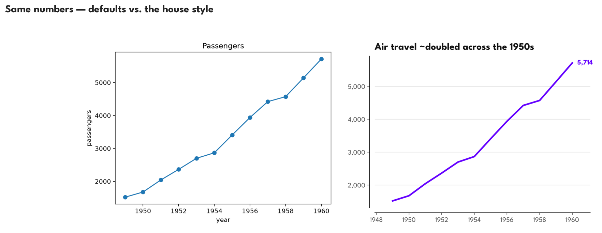
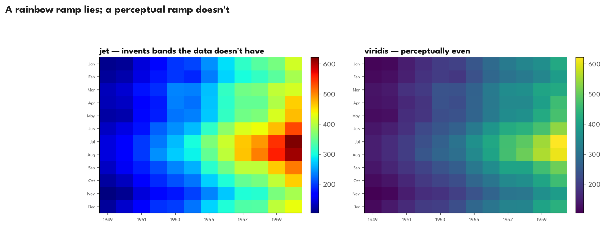
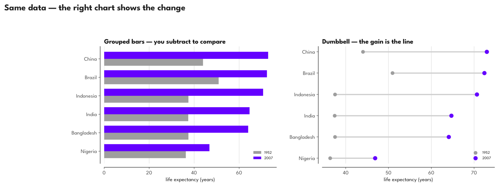

# Better Graphs


With AI, I can offload my unhealthy obsession with making graphs look nice to
agents! But they need to do a good job of it -- not a question of competence
but of taste!
Edward Tufte's [The Visual Display of Quantitative Information](https://www.edwardtufte.com/book/the-visual-display-of-quantitative-information/)
is our North star and the benchmark we're going to set for ourselves as
professional graph makers & commuicators of scientific data!

I'll also be making this repo _with_ an agent. My planned outputs are to have a
drop in 'skill' (if those things will still be around in a year), a general
AGENTS.md (or CLAUDE.md) file on my workspace's home directory that will direct
any agent to seek further advice from a tome of Python graphing wisdom,
flowcharts and inspiration before lifting a single finger to make a graph.

But more importantly, I want to teach myself how to do these in a pinch or just
direct stupider agents by giving guidance. So the `visualization-curriculum/` repo will include
notebooks (rendered from Quarto markdown documents) going through designs and
'modules' as if this was an actual course on better graphic design through
Matplotlib.

The `.ipynb` files are only going to be an artifact of my journey and not the
actual things I'll be working on as I'll use quarto live rendering to make an
html page with chapter sections as the curriculum I go through live.

By default, I'll assume these graphs are going to be shown on either a nice,
high resolution display over mediums like {ppt,pdf,png,jpg,gif}s or on a poster
you're proud to show off. This will affect the way we structure information,
the density of data we're comfortable showing, how closeby a stranger needs to
be from our graphs before understanding what they're about and optimizing for
post-presentation questions about how the hell you got your graphs to not even
look like Python anymore.

**A matplotlib craft curriculum + a reusable house style, so an agent can make
Tufte-grade figures with zero re-explanation.** Same numbers, same data — the
difference is taste, and taste can be written down as rules.







📖 **Read the full curriculum:** <https://temataro.github.io/better-work-graphs/>
*(M0–M7, each ending with a before/after on real data)*

---

## What this actually is

This is an **agent-instruction repo that happens to produce charts** — not the other
way round. The charts are byproducts; the deliverable is a self-contained instruction
set any future agent can follow. Three durable artifacts carry it:

- **[`CLAUDE.md`](CLAUDE.md)** — the operating manual: the workflow (choose → theme → OO
  API → takeaway title → polish → export) and the hard rules.
- **[`VISUALIZATION_GUIDE.md`](VISUALIZATION_GUIDE.md)** — the chart-*choice* framework: 10
  rules, a pre-flight checklist, a *(data shape × task) → chart* lookup, and a catalog
  (when to use / when not / the anti-pattern).
- **[`visualization-curriculum/house_style.py`](visualization-curriculum/house_style.py)** —
  the one-import lever: `apply_theme()`, `polish()`, `takeaway_title()`, `thousands()`,
  `add_colorbar()`, `diverging_norm()`, `save_all()`, and the `CATEGORICAL`/`ACCENT`/`GREY`
  palette.

The curriculum (`visualization-curriculum/better_graphs.qmd`, a Quarto → HTML course) is
the worked-example companion: each module states **one principle**, builds **one thing**,
and extracts **one durable rule** back into those three files. Data is numpy throughout
(`ndata.py`), never pandas in the plotting cells.

## Make your agent draw like this

Pick whichever fits your setup — they stack:

**1. Drop-in skill (Claude Code).** Copy the skill into a project (or `~/.claude/skills/`
for every project):

```bash
cp -r .claude/skills/house-charts ~/.claude/skills/
```

Then any "plot this / make a chart / improve this figure" request auto-loads the house
workflow and chart-choice rules.

**2. Global instruction.** Paste this into `~/.claude/CLAUDE.md` (or your `AGENTS.md`) so
*any* agent consults the design system before drawing — no local clone needed:

```markdown
## Before making any chart or data visualization
Consult the Better Graphs design system first and follow its workflow + hard rules:
- Operating manual: https://raw.githubusercontent.com/temataro/better-work-graphs/main/CLAUDE.md
- Chart-choice framework: https://raw.githubusercontent.com/temataro/better-work-graphs/main/VISUALIZATION_GUIDE.md
- The lever module: https://raw.githubusercontent.com/temataro/better-work-graphs/main/visualization-curriculum/house_style.py
State the chart type and WHY in one line before plotting. Use the matplotlib OO API,
a takeaway title (not an axis-name title), an accent-led palette over grey (never jet),
trimmed/offset spines, and unit-aware ticks. Ask for confirmation on dual-axis or pie.
```

**3. Project pointer.** One line in a repo's `CLAUDE.md`:

> For any figure, follow the Better Graphs house style
> (https://github.com/temataro/better-work-graphs) — chart choice first, then its workflow.

## Quickstart (build + render locally)

The plotting stack is uv-managed; the datasets are gitignored (regenerable):

```bash
uv sync                                              # plotting + jupyter stack
uv run python data/build_datasets.py                 # download + synthesize data/*.npz
uv run quarto preview visualization-curriculum/better_graphs.qmd   # live-reload course
uv run python assets/readme_figures.py               # regenerate the before/afters above
```

Publishing is automated: pushing to `main` triggers
[`.github/workflows/publish.yml`](.github/workflows/publish.yml), which rebuilds the data
in CI, renders the curriculum to a self-contained `index.html`, and deploys it to GitHub
Pages. *(Enable Pages → "GitHub Actions" in the repo settings once.)* For a one-off manual
deploy you can also run `uv run quarto publish gh-pages visualization-curriculum/better_graphs.qmd`.

## AI attribution

Built with **Claude Opus 4.8** as a pair author under human direction — drafting the
curriculum modules, writing and refactoring `house_style.py` and the snippets, and
rendering/verifying the figures. Editorial direction, data choices, and final review are
the author's.
